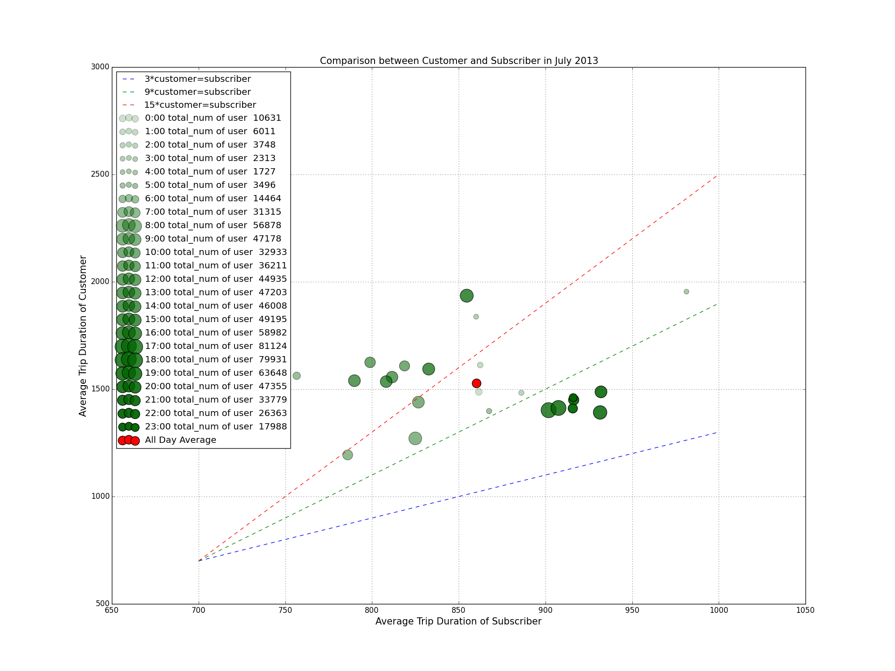

# PUI2015_jzhou/HW8

##Peer Review

###CLARITY
The visualization (Comparison between Customer and Subscriber in July 2013) is very clear to read. The three lines with different slopes are very helpful for readers to better understand the relationship between number of customers and that of subscribers.

###ESTHETIC
The visualization is esthetic with two different colors representing user number & average, and different size & alpha representing different number of users.

###HONESTY 
The visualization is honestly reproducing the citibike data.

###OTHER SUGGESTION
It might be better if you can provide a readme.md file for the visualization.

