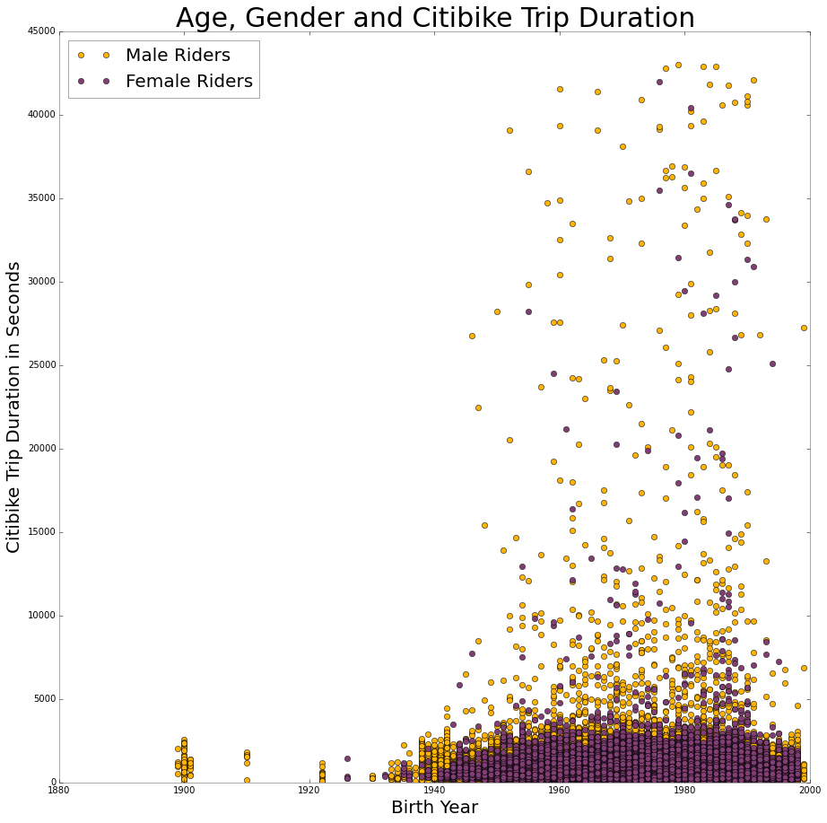

# PUI2015_jzhou/HW8

##Peer Review

###CLARITY
The visualization (Age, Gender and Citibike Trip Duration) is primarily clear to read, but it might be better to replace the existing "birth year" label with "age" after you calculate it.

###ESTHETIC
The visualization is esthetic with two different colors representing male and female riders.

###HONESTY 
The visualization is honestly reproducing the citibike data.

###OTHER SUGGESTION
It might be better if you can provide a readme.md file for the visualization.

