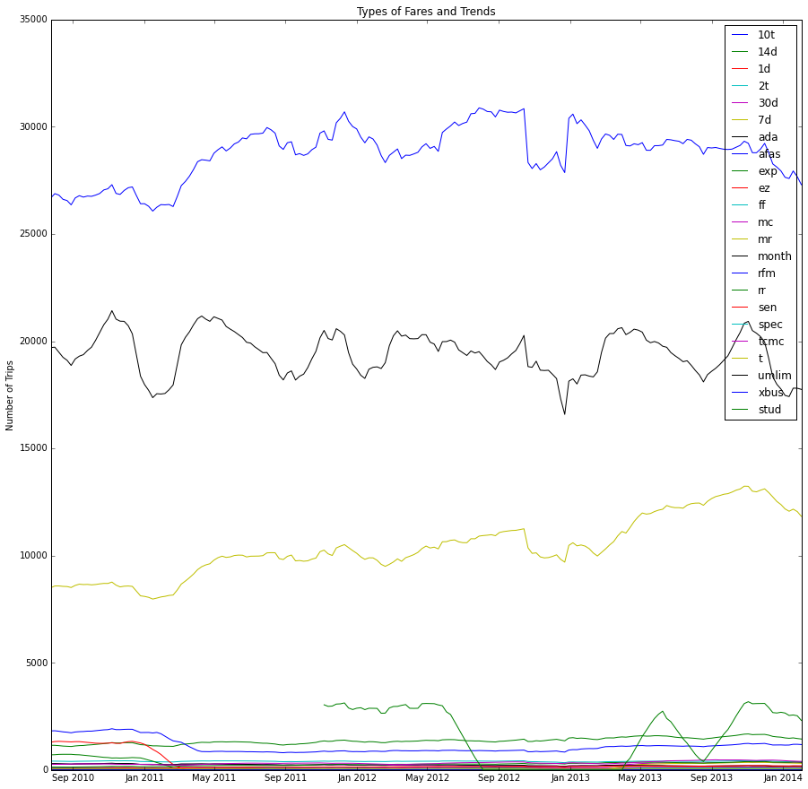

# PUI2015_jzhou/HW8

##Peer Review

###CLARITY
The visualization (Types of Fares and Trends) is primarily clear to read, but it might be hard to understand each labels of trends without further context or explainations.

###ESTHETIC
The visualization is esthetic with different colors representing different trends.

###HONESTY 
The visualization is honestly reproducing the MTA fare data.

###OTHER SUGGESTION
It might be better if you can provide your ipython notebook for the visualization.

